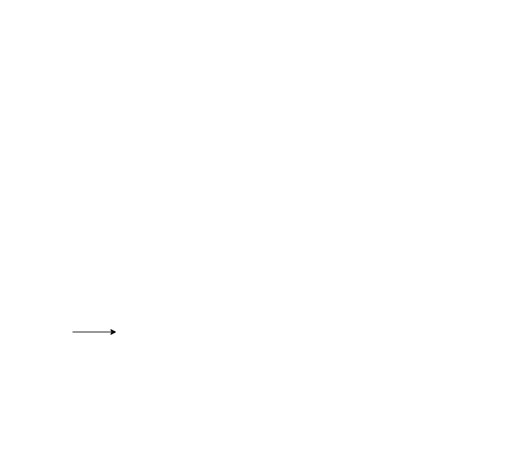

# Design Document

**Information Technology**  
**Google Workspace: Chat, Meet**

Prestige Worldwide  
RFP Number: CEO071234

Jason Kilpatrick  
UC Denver, INTE 5660: Developing Self-Pace eLearning

Review 360: Google Workspace ([eLearning Sampler](https://360.articulate.com/review/content/fb26fcab-0d74-4bd8-b9d4-bcab1cb3019d/review))

Submitted: November 22, 2020  
Resubmitted: November 29, 2020

## Learner Characteristics

**Who is your target audience?**

The Colorado Adult Education Professional Association, CAEPA, is a volunteer-run and a membership-supported 501(c)(3) nonprofit organization. The association is led by 20 dedicated volunteers located throughout the State of Colorado. Volunteers come from diverse backgrounds and work environments, including local community and faith-based organizations, community colleges, school districts, corrections facilities, workforce districts, and libraries. These volunteers make up the board of directors and are the target audience.

In their workplaces, volunteers have varying levels of experience with Google Workplace applications - some have none. Most volunteers are familiar with email and attachments but have not experienced other collaborative tools. Many are unfamiliar with shared online storage and may struggle with learning a new application. Most have set habits of communication that they use daily in their professional work environments and this training looks to broaden their horizons.

## Purpose/Goal

**What behavior or change does this training aim to implement?**

CAEPA needs new board members to demonstrate familiarity with Google Workspace to effectively communicate and collaborate with the board-at-large, within their first the month of joining the board of directors.

## Learning Objectives

**What are your measurable learning objectives?**

### Google Chat

By the end of the lesson, you will have practiced the following skills:

- Use Chat web application, <https://chat.google.com>
- Compose and format messages to individuals and groups
- Create and organize a room
- Turn on and search chat history
- Start a video chat

### Google Meet

By the end of the lesson, you will have practiced the following skills:

- Sign in to Google Meet, <https://meet.google.com>
- Create a meeting
- Invite people to join a meeting
- Manage a meeting
- Change the view of the meeting
- Present your screen

## Platform & Logistics

**Where will learning occur and where will assets be stored?**

Utilizing Rise 360’s online course builder, the content will be exported and imported into the Organization’s learning management system (LMS). Currently, CAEPA has access to both Google Classroom and Moodle LMS.

Moodle LMS is the stronger of the two options supporting SCORM and xAPI allowing completion to be recorded. Moodle LMS is a self-hosted service with unlimited storage, providing a secure place to save assets.

Additionally, Google Forms will be used to provide pre- and post-surveys to the learners. These forms will be created, stored, and hosted through the organization’s Google Drive. Data is stored within the application and collects the user’s email as a personal identifier.

For the [eLearning Sampler](https://360.articulate.com/review/content/fb26fcab-0d74-4bd8-b9d4-bcab1cb3019d/review), Review 360 will be used to demonstrate the course for simplicity, forgoing the need to login to the LMS for reviewing.

When implemented, the learners will be provided their new organizational credentials and provided the link to LMS. Learners will be assigned a board member to contact as part of the training. The designated board member will also be available via phone if the learner needs technical assistance.

## Measures

**How will you track, measure, and report successful learning?**

Rise 360 and Moodle LMS support both SCORM and xAPI. Learners will be able to login to Moodle LMS using organizational credentials and access the course. Moodle will then track activity - time spent in course and completion.

The course will be broken into sections by each Google Workspace application. Within each section, learners will be presented with a pre- and post-survey. Surveys will provide insight into learner’s abilities to perform tasks within each application before and after completing the section.

Each section of the course will be assessed independently. After the learner completes the activities within the section, they will be asked to complete a series of tasks demonstrating their new understandings. Tasks will be completed by the learner initiating a conversation, with their designated board member, using the application being introduced. If the learner can complete the tasks and communicate with their designated contact, the section is completed successfully. If the learner is struggling with the application, they may reach out to their designated contact using a more familiar method for additional technical support.

## Accessibility

**How will you ensure content adheres to the American’s with Disabilities Act (ADA)?**

Rise 360 is known not to fully meet Section 508 or WCAG guidelines. The designer is aware of this; therefore, the designer will actively ensure that all content meets four-conditions:

- Content is easy to see
- Content is easy to hear
- Content is easy to interact with
- Content is easy to understand

Since these conditions are subjective, the designer will utilize [tota11y](https://khan.github.io/tota11y/), a javascript-based accessibility checker, to identify accessibility issues relating to the four-conditions. The designer will aim to meet the highest guidelines (AAA) set forth by WCAG, exceeding Section 508 requirements. If accessibility issues are identified and are within the control of the designer, the content will be modified to pass the accessibility check.

Additionally, transcripts will be provided for all audio and video included within the training. All images will include a descriptive caption text (alt-text).

## Engagement

**How will your training achieve extraordinary educational engagement? What is your unique value proposition?**

Learners will be introduced to core applications to increase productivity and help communication and collaboration within the organization. The learners will be entering the training with high intrinsic motivation, as the organization is volunteer-run; however, reliability to complete training may vary for the same reason. The organization will place extrinsic motivation, by requiring the applications included in the training to be used while actively participating on the board.

The training will be “chunked” by each Google Workspace application the learner will explore. Within each section (chunk), the learners will have control over their learning paths - providing choice. The learner will be able to choose three paths, Certificate, Novice, or Experienced. They may choose to flow through one, two, or all three paths.

The Certificate path leads to an external site containing a comprehensive tutorial on the given application and is provided by Google. Before exiting the course, learners are prompted to return to and continue learning with the next learning path.

The Novice path provides a curated selection of videos from the Certificate path. Each video ranges from 2-3 minutes and covers the essential functions of each application. After viewing, the learner may choose to continue learning in the next learning path or move on to the assignments.

The Experienced path provides an overview of the application’s user interface. This learning path is aimed at learners who are familiar with the application. Learners will discover the application interface through an interactive screenshot. Labels will provide an animated gif as well as a text description of the functionality of the application interface. After completing the activity, learners may proceed to the assignments or continue learning in the alternate learning path.

Ultimately all paths lead to the section’s assignment list. This is a checklist of tasks to be completed with the learner’s designated board member contact. Since Google Workspace applications are intended to foster team communication, each task completed in the course will be connecting the new board member to others serving on the board of directors.
This communication is, in essence, the capstone of the course.

## Workflow

**Provide a visual workflow, demonstrating the learner’s journey, branching, and assessment points.  Optionally, provide samples of your visual aesthetic/slide design.**

This flowchart depicts the introduction followed by the learning paths presented for each Google Workspace application.

<figure markdown>
  
  <figcaption>Flowchart detailing seven step training flow (1) Introduction, (2) Sign in, (3) Direct to app introduction, (4) App introduction, (5) Choice, (5.1) Tutorial, (5.2) Video series, (5.3) User interface, (6) Check list of tasks to complete, (7) Review.</figcaption>
</figure>
