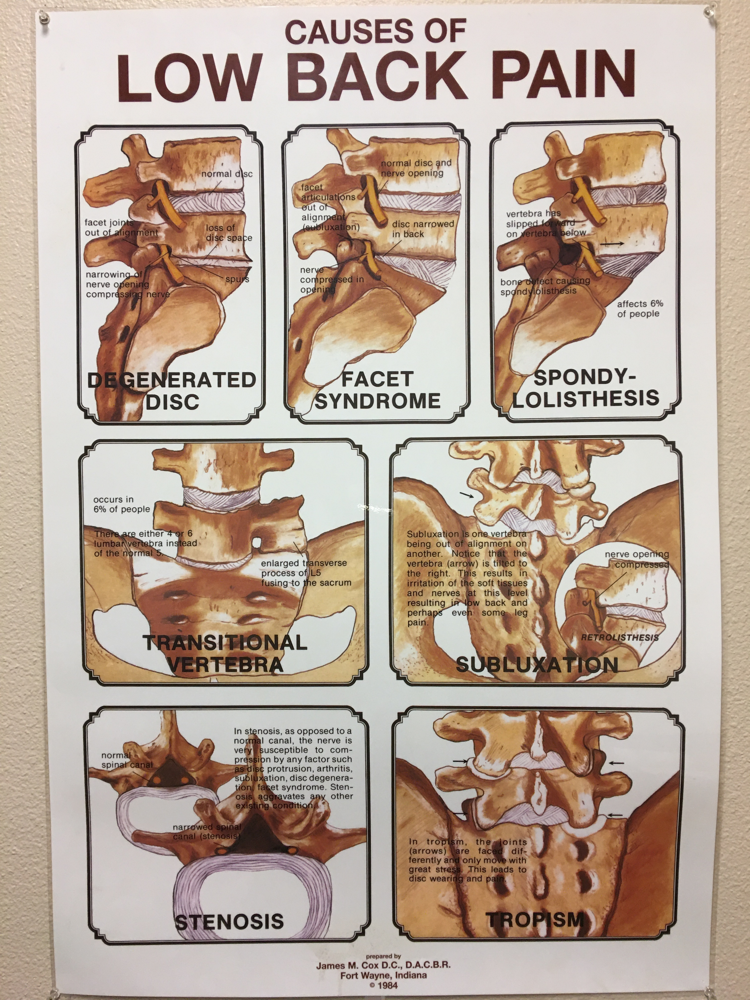
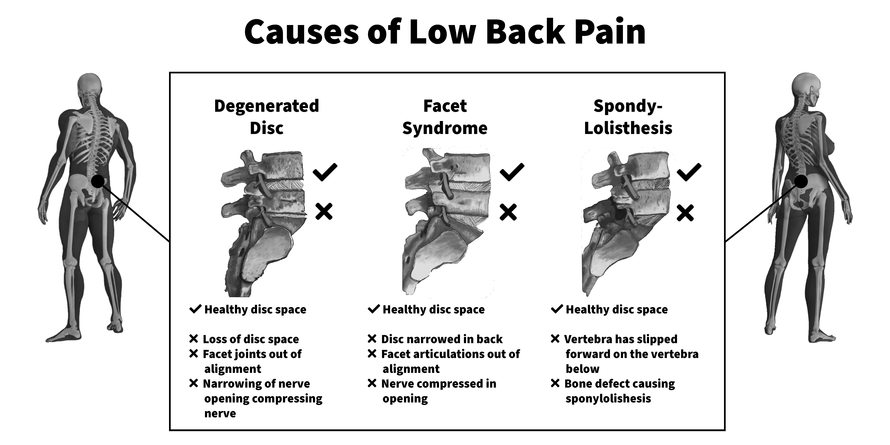

# Designs for Low Back planning

<figure markdown>
  
  <figcaption>Original</figcaption>
</figure>

This poster is consistently terrible. I notice that one of the frames is labeled "Subluxation" and at my chiropractor, they have a similar poster, but it contains six frames that only focus on Subluxation. This tells me that this poster might be overly simplified, but I do not have the knowledge base to fill in the details. But sticking with design principles, let's make some changes.
Designs for Low Back Pain

*Describe three ideas you have for improving this poster based on Inclusive Design guidelines.*

This poster assumes the viewer knows where these bones are located in the body. So first thing I propose is adding a full-body diagram highlighting where in the world we are looking at the body. I'm assuming this is only the pelvic area, but I honestly thought those were neck bones for a while.
Second, I cannot tell what is wrong with anything in the pictures themselves. To resolve this there should be some clear indicators of what is good versus bad.

Third, the images are staggered inconsistently. Let's fix that somehow. Starring at the graphic, I'm starting to see that there are three panels showing a side view and three panels showing a front view. I have no idea what the seventh panel is showing; would that be the top view? This can be arranged in a better order to signify the position.

*Describe three ideas you have for improving this poster based on Universal Design for Learning guidelines.*

Let's make this poster accessible since Universal Design is the first circle encompassing accessibility.

First thing, let's not have the text over the images.
Second, let's move the headings (titles) to the top of the images and enlarge the smallest font size.

Third, let's drop the color and go grayscale as having "brown" bones is unnecessary to convey the messaging.

<figure markdown>
  
  <figcaption>Adobe Photoshop, Adobe Illustrator</figcaption>
</figure>

## Attributions

- [3D Female Skeleton Anatomy.png by Bernhard Ungerer](https://commons.wikimedia.org/wiki/File:3D_Female_Skeleton_Anatomy.png), [CC BY 3.0](https://creativecommons.org/licenses/by/3.0), via Wikimedia Commons
- [3D Male Skeleton Anatomy.png by Bernhard Ungerer](https://commons.wikimedia.org/wiki/File:3D_Male_Skeleton_Anatomy.png), [CC BY 3.0](https://creativecommons.org/licenses/by/3.0), via Wikimedia Commons
