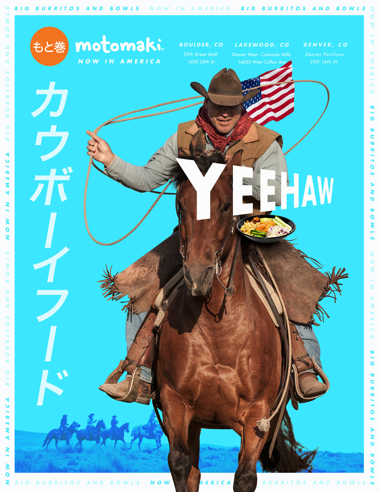

## Media Deconstruction

  <iframe class="aspect-ratio--content" src="https://www.youtube-nocookie.com/embed/VQxdTGN4sqY" title="YouTube video player" frameborder="0" allow="accelerometer; autoplay; clipboard-write; encrypted-media; gyroscope; picture-in-picture" allowfullscreen></iframe>

1. To complete your Week 1 Media Deconstruction Assignment watch this video that describes how to use the 5 Key Questions to complete a media deconstruction.
2. Find a "print advertisement" or stll image advertisement (similar to the one in the video example) to critique something you have seen recently.
3. In this Discussion Thread, post an image of the advertisement you have chosen along with a brief (a few sentences per question is fine) analysis of the advertisement using the 5 Key Questions as your guide. I have included an example to get us started.

***

<figure markdown>
  
  <figcaption markdown>Motomaki advertisement</figcaption>
</figure>

1. **Who created this message?**

    I would imagine a marketing firm for the Motomaki business created the message.

2. **What creative techniques are used to attract my attention?**

    The advertisement employs a bold blue background to distract the reader's eye and pull them into the ad. A single predominant image is present that is in contrast to the bold blue background. Overly simplified text force the reader to pause and interpret the messaging. The use of a "cowboy" might be playing on Denver. The use of the American flag is also playing to the new location.

3. **How might different people interpret this message differently than me?**

    As a Denver resident, I find this advertisement is targeting those who are not living in the city. The ad is playing on the idea that Denver is still a part of the wild west, i.e. stock show culture, maybe? It's also challenging what a "cowboy" might eat when visiting Denver; in the margins, the ad states motomaki is an eatery serving burritos and bowls.

4. **What viewpoints or world views are included or left out of this message?**

    I am confused by the bilingual aspect of the advertisement. Is it a Japanese eatery, but also catering to the common burrito trend? The American flag symbolizes the "Now in America" theme to the message but is leaving out where the establishment is coming from; if it's "Now in America" where was it before? The advertisement is strongly catering to a masculine audience, in imagery and color.

5. **Why is this message being sent?**

    The message is to notify readers that a new food establishment is in town to gain customers.

## Media Use Journal

1. This week track your media usage every day for three days in a row.
2. First, write down your most used platform or channel - writing down what you use it for.
3. Continue to add more channels and platforms, ranking them in order of use how often and for what reasons you use each type of media or media channel. You can complete your journal entry one of three ways.

***

**My media channels**  
*applications listed from most used*

### Daily overview

I use my technology pretty much the same way daily. I start my day at my desktop, where I primarily use the Brave Browser with the uBlock Origin extension. This combination blocks nearly all advertisements from my view and even blocks YouTube ads. I generally navigate to listen to music while having morning coffee. I look up whatever may be on my mind that morning in the browser. I check in on Slack channels and check my email. I also open up Canvas and complete readings and class meetings. I do not use Social Media, except for LinkedIn, and do not check in often these days. Music generally plays throughout my day. I have stopped following the "News" as it tends to be negative, so that is no longer part of my daily routine.

### June 7 - June 12, 2021

**Mac mini**

- Browsers (Brave and Safari): Web browsing and online shopping. I use it for job and internship searching. It also connects me to Canvas for classwork.
- Slack: I use this to talk to friends, network, and for class discussions daily.
- YouTube Music: My go-to source for music. Since I use a content blocker, the advertisement-based service has zero advertisements. And it is free. This is technically a browser-based application.
- Disk Drill: This is disk recovery software that I have been using to recover data from old hard disk drives, as I migrate them to a new solid-state drive network-attached storage.
- Grammarly: I use this application when drafting out responses to just about everything. I like the simplicity of having my grammar checked, but it is also distracting for first drafts.
- Zoom: The official UC Denver meeting application. Currently, I have one class that holds weekly Wednesday afternoon meetings. During the meeting, we are updated with weekly lesson objectives and complete groupwork synchronously here. If someone is unable to attend the work becomes asynchronous and is submitted to a Canvas discussion.
- Adobe Creative Cloud: I produce media, both for class and independently. I primarily open up Illustrator and Photoshop to complete projects. This week I created a logo in Illustrator but also needed to convert some images using Photoshop. I also do video editing, but not this week.

**iPhone**

- Browsers (Brave, Safari, Firefox Focus): When I am out and about, sometimes I feel the need to look stuff up. Depending on what it is, I use the browser that provides the layer of privacy I desire for the search. Safari has the lowest protection. Brave and Firefox Focus are about equals here. Firefox Focus doesn't retain any cookies or history, so for general searches, this is my go-to browser, followed by Brave. When sites "are broken" from the privacy-centric browsers, I switch to Safari.
- YouTube Music app: I listen to music while I am out and about. Since I only travel by bicycle or by walking, it's the perfect time to listen to music.
- Canvas Student app: I check in on class assignments while out walking or sitting in the park. Refresh my mental to-do list; so I can reflect and prepare.
- Slack app: I use this primarily to talk to friends and check in on class challenges on the go.
- Gmail: Personal email service - This opens links into browsers that look like additional apps, but are just email messages.
- Shazaam: When I hear a song I want to remember and it isn't playing on my device, I use this app.
Messages app: I talk to friends and family through text messaging.
Phone app: I rarely use the phone app, ironic.

## Reflection

1. **What are your interests outside of school, work, and this class?**

    Ah, the work-life balance question. I enjoy getting outside for bicycle rides - to nowhere - and spending time in the parks around me here in Denver, CO. Aside from that, I like to make media! I'm an artist and enjoy working in a variety of media. From India ink and watercolor to charcoal. I also enjoy working in three dimensions (sculpture). I've spent quality time learning web development and enjoy working in digital media as well.

2. **Tell us about yourself, family, pets, hobbies, passions.**

    I live in Denver, CO. I love cats, but currently am petless. See question 1 for hobbies and passions. But to extend this, I would also include work. I enjoy working in education, supporting others, and seeking to work for a mission-driven organization that I can get behind.

3. **Where are you in terms of your academic or education journey?**

    I began the LDT Masters program in Fall 2020. At this point, I am halfway through, and after this Summer, I am planning for Fall to be my final semester.

    How did you come to enroll in this course? This course is part of the required courses for the new Digital Pedagogy and New Literacies certificate,  Fall 2021. To keep with my anticipated graduation, I enrolled in the class, pre-update.

4. **Have you worked or are you currently in a library, school, or working in education? What grade/level?**

    In what capacity? Until August of 2020, I was working in Adult Basic Education for the last 10+ years as an Instructor, Distance Learning Coordinator, and ultimately Program Coordinator. Unfortunately, planned federal funding cuts eliminated my program during 2020. I am currently sitting president for CAEPA, Colorado's professional organization supporting Adult Education programs through advocacy, professional learning, and resource sharing.

5. **What do you feel are the "hot topics", "buzz words", or trends in education today?**

    I think diversity, equity, and inclusion (DEI) may be the current buzzwords gaining attention.

6. **What do you hope to gain from this course?**

    I would like to continue gaining insight into Media. Continuing from my last class in Learning with Social Media (which has now been eliminated). After this first week, I'm intrigued by the weekly media deconstructions, and then applying this to media constructions.

7. **What topics do you hope we cover? I would hope to cover some "hot topics" and "buzzwords" that we all mention.**

    What does it mean to be "media literate"? Having gained insight into this from the first-week coursework, it would mean critically thinking about media and becoming an active and aware participant in the conversation. This idea aligns well with past lessons I created and taught on Media Literacy, whereas the focus of the lesson looked very similar to that of the 5 Key Questions of Media Literacy in the Ted-Ed lesson.

8. **What does the term "media literacy" mean to you?**

    My feelings on media literacy align well with the previous question and the 5 Key Questions. I believe media literacy is acknowledging that media has a purpose, target audience, and a reason it was created. To naturally question and critically think about the intentions of media, is media literacy.
