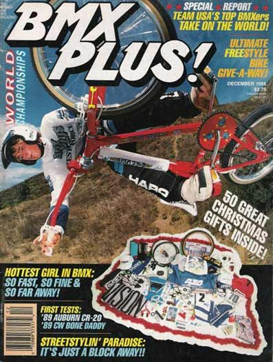
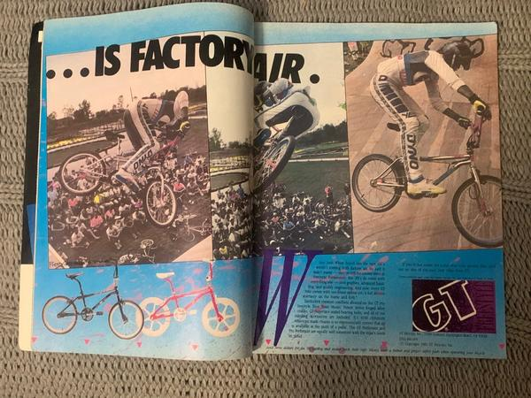

## Media Deconstruction

1. After completing your media journal assignment see if you can find a youtube video or image of the advertisement for that toy (or another toy) that you wanted as a child.
2. In this Discussion Thread, post the link to the advertisement along with your Media Deconstruction using the 5 Key Questions as your guide. In this week's analysis, I want you to focus on the context of the time in history that the message was being sent. For example, the toys being targeted to me as a child in the 1970s had very different messaging due to the political and social expectations of the time. When you talk about the creator of the message, think about that company in the context of that moment in history.

***

I'm submitting numerous images from a December 1988 magazine called BMX Plus! I remember having a subscription to this magazine and desiring just about anything from inside. I wanted a "real" bicycle, but we could not afford one. My bicycle at the time was my Uncle's old BMX bike, store brand. I later inherited my Father's store-brand mountain bike that he no longer rode. I later bought a used BMX bicycle at a Garage Sale, but it wasn't any manufacture featured in this magazine - so think huffy - noncompetitive. I wanted a bicycle I could ride in competitions.

I was thinking about this magazine, and in its entirety could be considered one giant advertisement. Perhaps, similar to that of today's influencer. I say that because the magazine interviews professional riders, about the history, tips & tricks, and their gear. This connects the reader to personalities, but also products.

For this deconstruction, I will critically look at the final image in the image list.

<figure markdown>
  
  <figcaption markdown>BMX Plus Magazine Dec 1988 Issue (Cover)</figcaption>
</figure>

<figure markdown>
  
  <figcaption markdown>BMX Plus Magazine Dec 1988 Issue (Advertisment 1)</figcaption>
</figure>

<figure markdown>
  
  <figcaption markdown>BMX Plus Magazine Dec 1988 Issue (Back)</figcaption>
</figure>

<figure markdown>
  
  <figcaption markdown>BMX Plus Magazine Dec 1988 Issue (Advertisment 2)</figcaption>
</figure>

1. **Who created this message?**

    This advertisement was created by the GT Bicycle Company. To quote, "BMX was the foundation for the GT empire. It was our foray into bikes and drove the passion we are lucky enough to follow every day. The current GT BMX Lineup is designed to fuel your fire and get you stoked on going bigger, faster, and further" ([GT Bicycles](https://www.gtbicycles.com/can_en/bikes/bmx)). GT Bicycles were founded in 1972 and were a key player in spreading the BMX bicycle. Throughout the 80s, GT acquired several up-and-coming brands to form its empire; However in the 90s as interest in the sport declined the company was sold off and made public ([Wikipedia](https://en.wikipedia.org/wiki/GT_Bicycles)).

2. **Which techniques are used to attract my attention?**

    It's a full spread - filling two pages. This makes it impossible for the reader not to catch a glimpse of it. The ad also captures the aesthetic of the magazine with a large, stop motion, image mimicking the actual articles in the magazine.

3. **How might different people interpret this message?**

    As a kid, I would see the images of the bicycles in the lower-left corner and desire them to be able to do the trick above. Parents may see the trick above and have mixed feelings about allowing their child to perform such a thing.

4. **Which lifestyles, values, and points of view are represented -- or missing?**

    The entire magazine is targetting those who are interested in BMX. This advertisement is targetting a specific subsection of the sport and looks to be flatland or half-pipe riders. The gender is hidden behind the protective gear but could be assumed to be male, as they dominate the ads. Flipping through the magazine and viewing several articles and advertisements, the sport was included multiple genders, races, and ethnicity. The sport also extended beyond the U.S. territory, as seen in issues highlighting BMX worldwide.

5. **Why is this message being sent?**

    This advertisement is being sent to endorse the GT Bicycle company. Often times the text not only highlights their product but also features a snippet about one of their sponsored riders. So advertisements would typically endorse the team and the products the team uses.

## Media Use Journal

This week I would like you to reflect upon your childhood and how adver!sers
found you.

1. **What are the most memorable toys that you played with as a child? What do you remember most about those toys?**

    This has been a challenging question for me this week, as I do not recall having much as a child growing up. I do remember that most of my toys were gifted to me through hand-me-downs or hand-made. My parents were young, even by today's standards. It wasn't until late elementary - 5th or 6th grade / 1989 or 1990 - that I recall shopping for toys.

    So early in my youth, I remember my mother sewing me "Carebears" made from patterns at the fabric store. I also remember my Grandmother making me a "Cabbage Patch" doll. Well, she made one for everyone in the family, but mine was special.

    My Grandfather made me several wooden gifts in his woodshop. One such gift was homemade lincoln logs. I remember I would stack and build structures from these and try new designs. There were no instructions or pictures included, so everything had to come from my imagination.

    I remember having a whole bunch of second-hand legos gifted to me. The legos were those of my three uncles' combined sets. These were brought to me in some sort of large container, again with no instructions or pictures. I had to build everything from my imagination. Today, this would look like that Lego TV show that challenges participants to build things, while kids watch.

    I also remember one of my Uncles gifting me his BMX bike. This gift may have sparked my interest in bicycles that I carry to this day. I remember riding it through the trailer park and behind the junkyard to some dirt track. There were other kids there. I suppose they were from the neighborhood. We moved often, so I didn't know anybody. I would've been early elementary, maybe 3rd or 4th grade? Anyway, I remember riding on that dirt track. Overcoming the fear of the steep hills and speeding around. I remember being encouraged by others that were there. That is memorable.

    I remember playing with all these things at different points of my childhood, as we moved from place to place. I never thought anything of them being gifted,  hand-me-downs, or homemade. I don't ever remember having a desire for anything other than what I had.

2. **How did you get the toys? Were they gifts? Did someone buy them for you? If you know, where were they purchased? Do you have a memory of purchasing the toy?**

    I remember shopping for "Carebear" fabric with my mother at a young age. I don't recall the television show at all, which came out in 1985. There were many patterns to choose from; we selected two or three Carebear patterns. I remember we choose by color and their symbols. We probably made up our meanings for the bears, seems like the thing we would have done. So no marketing influence my decision-making. I remember my Mother sewing them together for me and I helped stuff them. These Carebears joined me with my other stuffed animals that I had collected as gifts.

    I don't remember ever going to the store and buying any stuffed animals, and yet somehow I had like 50 of these things by late elementary school. They kept me company in my bed and bedroom right up to High School. I then passed them onto my new step-siblings, carrying the tradition forward.

    Everything else in my early elementary days where gifts. It wasn't until late elementary that I remember going to a store and buying toys, and that happened not frequently. I also remember receiving IOUs as gifts because we couldn't afford the toys at the store, yep.

3. **Do you remember any TV advertisements for the specific toys you are writing about? If not, was there some other reason behind your desire for the toy?**

    Yeah... like I said in other discussions, this topic is really hard for me to relate to. I don't think we had a television and if we did, I don't recall watching it until late elementary. I did have books though. These were gifted to me as well. Except those that were purchased through the school book club, but that wasn't until later. However, I remember my Grandmother taking me to a bookstore in these early years and looking at all the Dr. Suess books. We choose one. She bought it for me and then later read it to me. There was no advertisement, and neither of us knew what the book would be about. We bought the "The Butter Battle Book." Turns out this book is about the arms race, nuclear war, with a touch of WWII... I thought it was about toast at this age.

    These are all great memories for me and think that I was very fortunate to have such a loving, gifting, caring family. I am also fortunate that my family was industrious and created these things for me. I would imagine my experience would have been similar, given the same financial circumstances and family, even with today's current marketing.

## Reflection

1. **What is media literacy and why is it so important? After watching the videos and reading the articles how has your definition of media literacy changed since the beginning of the course?**

    Media Literacy is the critical evaluation of the many aspects of media, including who published it and why they published it. Through analysis, it is possible to identify the intended audience and the meaning it may have intended to convey to them. We can also interpret, who wasn't included as audience and how the same message may be perceived by them. Understanding media helps to better understand and interpret the world we live in.

    At this early point in the course, I find the 5 Essential questions as a new stepping stone to helping students understand media. As for my understanding, I entered the course with some background understanding of Media Literacy, both personally and professionally.

2. **Share your thoughts about last weeks media deconstruction activity. Which questions are the hardest to answer and why?**

    I think questions 3 & 4 from the 5 Key Questions of Media Literacy are the most difficult and yet most helpful.

3. **How might different people interpret this message? Which lifestyles, values, and points of view are represented -- or missing?**

    Both of these questions ask the viewer to step back from self and apply understanding from others' points of view. When removing self from the interpretation, the options of interpretation become endless - as people are complex beings. When removing self, we are also opening ourselves up to misidentify others' experiences and observations of the media - apply stereotypes or other falsehoods. So perhaps, question 3 is the most challenging because it is the vaguest and ambiguous.

4. **Which questions are the most helpful and why?**

    As stated in the last question, the most difficult questions to answer are the most important. However, I now arrive at perhaps question 4 being most helpful. In that, when identifying the group being targeted (lifestyles, values, and points of view) it becomes easier to see who is missing.  This may also lead to a greater understanding of how those not included may view the media, the most difficult question to answer.

5. **In Kellner and Share's Media Literacy is Not an Option, the authors state the following in their conclusion;**

    !!! quote

        The task for educators and researchers is to engage in a new type of literacy education, from pre-school to higher education that incorporates new information communication technologies, media, and popular culture with critical pedagogy. This work must challenge dominant ideologies and empower youth to unveil the myths through creating their own alternative representations that empower their own voices and struggles for social justice.

    **What do you think of this statement? Is it the job of educators to challenge dominant ideologies? What role should educators play, if any, in the institution of media literacy education?**

    In 2021, this sounds like a loaded question. But, Yes, education should challenge the status quo - dominant idealogy. It is the role of education to expand students' knowledge, and this means building an understanding of multicultural experiences.

    Repeated throughout Keller & Share article was the idea of examining power, and empowering students to have a voice in their learning. To build Active Learning and Participatory Learning communities.

6. **As educators, how do you feel about Kellner and Share's following recommendation about the institution of media literacy education from pre-school to university?**

    !!! quote

        We recommend that media education programs be instituted from preschool to university and that linking media literacy with production become a regular practice. Standards for media literacy programs should include criticizing the ways that media reproduce racism, sexism, homophobia, and other prejudices and encouraging students to find their own voices in critiquing media culture and producing alternative representations."

    Through my instructive experience utilizing the College & Career Readiness Standards (CCRS) - the highest level of the Common Core State Standards (CCSS) - I recall having students understand, analyze, and interpret several points of view in a variety of media. We even produced various types of media, including infographics, advertisements, and other simple types of media. This naturally found its way into discussing racism, sexism, homophobia, and other prejudices, as the projects were based on Active Learning principles - creating a Participatory environment. As the instructor, I was also including media that intentionally exposed varying points of view.

    Having less experience in Elementary Education than I do with Middle & High   School students, with the most experience in Adult Basic Education, I would be at a disadvantage to speak to what this might look like in younger students. I do think it is important for the discussion to take place and it would also be helpful for parents to engage in the conversations too.

    *I would note, that Colorado adopted the CCSS in 2010, and the Kellner & Shares article was published in 2007 ([n.d., CDE](https://www.cde.state.co.us/contentareas/ccss_in_the_colorado_standards)).*

7. **After reading [HOUSE BILL 21-1103 CONCERNING IMPLEMENTING THE RECOMMENDATIONS OF THE MEDIA LITERACY ADVISORY COMMITTEE IN ELEMENTARY AND SECONDARY EDUCATION](https://leg.colorado.gov/sites/default/files/2021a_1103_signed.pdf) what do you think it means for Colorado Students? Is it enough? Is it too much? Why or why not? What would you add or eliminate, if anything?**

    I read it as an intentional act, to reinforce the Common Core State Standards. Kellner and Share stated, "While media education is now expected to be taught since it is listed in almost all the state standards, unfortunately, little has been done to train teachers, provide resources or create curriculum" (2008, p. 9.). I think Colorado's Bill is moving towards filling the professional learning gap in teacher education. With the other standards, Colorado has outlined resources and furthered those standards, to my knowledge. This bill is seeking to do the same for Media Literacy. Is it enough? It's a start... I think like all the standards parents also need to be involved, otherwise, we might hear phrases that sound like, "and now we have these new media standards, what are they doing?" Having parents and children involved might also help achieve the Participatory approach that Dewey envisioned a century ago, as well (Kellner & Share, 2008).

8. **What does the Feb 2020 Atlantic article describe as the "sneaky ways" advertisers are finding to reach kids other that TV ads? How is this different or the same from your childhood experience?**

    I believe two distinct methods were described in the article. The first, creating media with the intent of selling merchandise aligned to it. The second, utilizing influencers to reach audiences. And as I have been reflecting, I can't help but wonder if reality television made way for the influencer phenomenon?

    My childhood experience is so far removed from this discussion, in that I do not recall having a television until late elementary school. This also includes seeing movies. While today's parents are putting media devices in their children's hands from birth onward...! I was very late to the smartphone revolution, so I am sure, many people's children were fully immersed in the technology before it even made it to my hands. I think that says a lot about the differences in how people can be raised.

    However, I would note, that I was learning to code the applications that run on the smartphone before owning one... and in late elementary school, I was learning basic coding on the early Macintosh in after-school programs. But in my earliest years, advertising media was nonexistent.

9. **When and how did advertisers reach you as a child? Are there other ways, not mentioned in the Atlantic article, that you have noticed in your own lives that advertisers gain access to children?**

    As noted above, advertising was absent from my earliest years. Advertising didn't reach me until I took interest in activities that were in magazines.

    In thinking of ways advertisers reach children, did anyone mention product placement? I guess this is the form of media being created with the intent of selling merchandise - hello Disney - and just about every child actor coming out of their studios - Hannah Montana AKA Miley Cyrus, to name one of many. What about the many facets of reality television - American Idol?

10. **We may hit upon topics that may feel uncomfortable for some in this course. Discussion is not always easy but it is so important at times like these. This includes topics such as media portrayals of violence, opposing political agendas, sexual violence, discrimination and social injustices of all kinds. What can we do as fellow learners to ensure a civil environment for dialogue in this learning space?**

    I think the keyword here is dialogue, the give and take of information. When entering into dialogue it is a two-way street of sharing ideas to build a new common ground of understanding. We are imperfect human beings, and as such we are neither right nor wrong, but building towards a greater understanding. Knowing this furthers the dialogue and builds awareness to new ideas; however, coming at someone with a pitchfork and an eraser is a sure way not to further dialogue.

11. **How are you doing? You don't have to answer this question directly in a public thread - you can simply know that as your instructor I am cognizant and aware that the closing few months have been a struggle for many. I will not lose sight of that in this course. Please reach out if there is anything I can do (or not do) that would make this experience better for you. Within reason, of course. We have learning to do, and that isn't always stress-free. I have been a graduate student and I commend your commitment to learning during an uneasy time.**

    Thanks, I am doing well.
