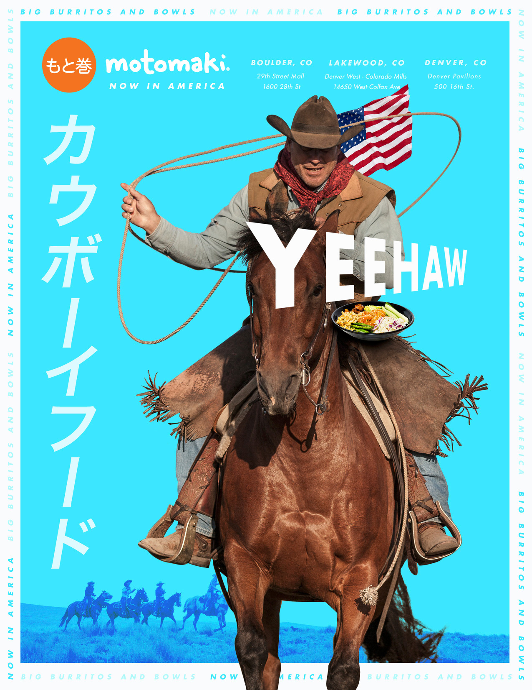

??? quote "Assignment"
    1. To complete your Week 1 Media Deconstruction Assignment watch this video that describes how to use the 5 Key Questions to complete a media deconstruction.
    2. Find a "print advertisement" or stll image advertisement (similar to the one in the video example) to critique something you have seen recently.
    3. In this Discussion Thread, post an image of the advertisement you have chosen along with a brief (a few sentences per question is fine) analysis of the advertisement using the 5 Key Questions as your guide. I have included an example to get us started.

  <iframe class="aspect-ratio--content" src="https://www.youtube-nocookie.com/embed/VQxdTGN4sqY" title="YouTube video player" frameborder="0" allow="accelerometer; autoplay; clipboard-write; encrypted-media; gyroscope; picture-in-picture" allowfullscreen></iframe>

## Media Deconstruction

<figure markdown>
  
  <figcaption markdown>Motomaki advertisement</figcaption>
</figure>

1. **Who created this message?**

    I would imagine a marketing firm for the Motomaki business created the message.

2. **What creative techniques are used to attract my attention?**

    The advertisement employs a bold blue background to distract the reader's eye and pull them into the ad. A single predominant image is present that is in contrast to the bold blue background. Overly simplified text force the reader to pause and interpret the messaging. The use of a "cowboy" might be playing on Denver. The use of the American flag is also playing to the new location.

3. **How might different people interpret this message differently than me?**

    As a Denver resident, I find this advertisement is targeting those who are not living in the city. The ad is playing on the idea that Denver is still a part of the wild west, i.e. stock show culture, maybe? It's also challenging what a "cowboy" might eat when visiting Denver; in the margins, the ad states motomaki is an eatery serving burritos and bowls.

4. **What viewpoints or world views are included or left out of this message?**

    I am confused by the bilingual aspect of the advertisement. Is it a Japanese eatery, but also catering to the common burrito trend? The American flag symbolizes the "Now in America" theme to the message but is leaving out where the establishment is coming from; if it's "Now in America" where was it before? The advertisement is strongly catering to a masculine audience, in imagery and color.

5. **Why is this message being sent?**

    The message is to notify readers that a new food establishment is in town to gain customers.
