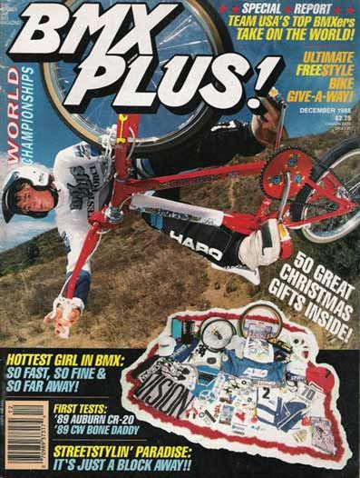
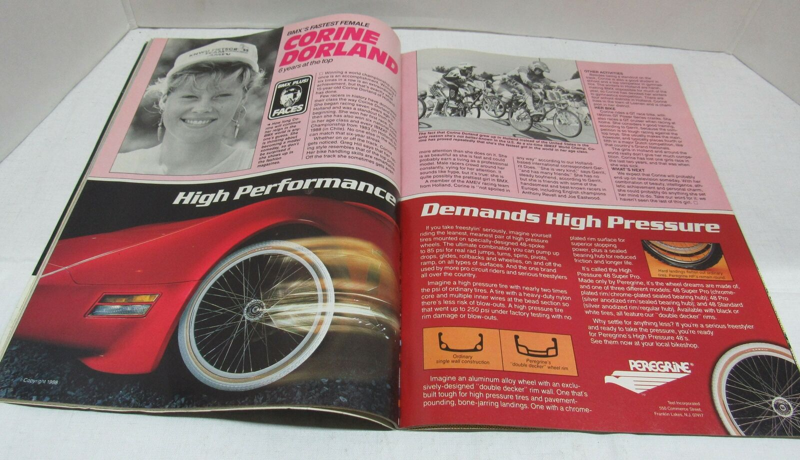
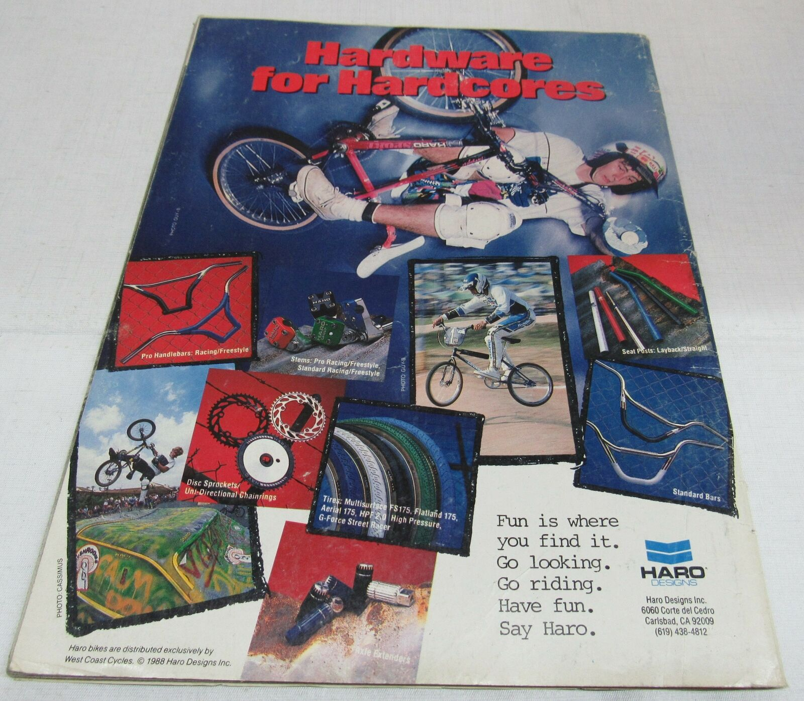
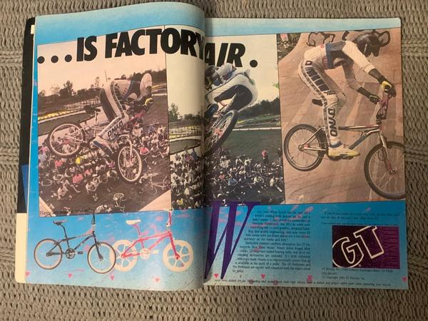

??? quote "Assignment"
    1. After completing your media journal assignment see if you can find a youtube video or image of the advertisement for that toy (or another toy) that you wanted as a child.
    2. In this Discussion Thread, post the link to the advertisement along with your Media Deconstruction using the 5 Key Questions as your guide. In this week's analysis, I want you to focus on the context of the time in history that the message was being sent. For example, the toys being targeted to me as a child in the 1970s had very different messaging due to the political and social expectations of the time. When you talk about the creator of the message, think about that company in the context of that moment in history.

## Media Deconstruction

I'm submitting numerous images from a December 1988 magazine called BMX Plus! I remember having a subscription to this magazine and desiring just about anything from inside. I wanted a "real" bicycle, but we could not afford one. My bicycle at the time was my Uncle's old BMX bike, store brand. I later inherited my Father's store-brand mountain bike that he no longer rode. I later bought a used BMX bicycle at a Garage Sale, but it wasn't any manufacture featured in this magazine - so think huffy - noncompetitive. I wanted a bicycle I could ride in competitions.

I was thinking about this magazine, and in its entirety could be considered one giant advertisement. Perhaps, similar to that of today's influencer. I say that because the magazine interviews professional riders, about the history, tips & tricks, and their gear. This connects the reader to personalities, but also products.

For this deconstruction, I will critically look at the final image in the image list.

<figure markdown>
  
  <figcaption markdown>BMX Plus Magazine Dec 1988 Issue (Cover)</figcaption>
</figure>

<figure markdown>
  
  <figcaption markdown>BMX Plus Magazine Dec 1988 Issue (Advertisment 1)</figcaption>
</figure>

<figure markdown>
  
  <figcaption markdown>BMX Plus Magazine Dec 1988 Issue (Back)</figcaption>
</figure>

<figure markdown>
  
  <figcaption markdown>BMX Plus Magazine Dec 1988 Issue (Advertisment 2)</figcaption>
</figure>

1. **Who created this message?**

    This advertisement was created by the GT Bicycle Company. To quote, "BMX was the foundation for the GT empire. It was our foray into bikes and drove the passion we are lucky enough to follow every day. The current GT BMX Lineup is designed to fuel your fire and get you stoked on going bigger, faster, and further" ([GT Bicycles](https://www.gtbicycles.com/can_en/bikes/bmx)). GT Bicycles were founded in 1972 and were a key player in spreading the BMX bicycle. Throughout the 80s, GT acquired several up-and-coming brands to form its empire; However in the 90s as interest in the sport declined the company was sold off and made public ([Wikipedia](https://en.wikipedia.org/wiki/GT_Bicycles)).

2. **Which techniques are used to attract my attention?**

    It's a full spread - filling two pages. This makes it impossible for the reader not to catch a glimpse of it. The ad also captures the aesthetic of the magazine with a large, stop motion, image mimicking the actual articles in the magazine.

3. **How might different people interpret this message?**

    As a kid, I would see the images of the bicycles in the lower-left corner and desire them to be able to do the trick above. Parents may see the trick above and have mixed feelings about allowing their child to perform such a thing.

4. **Which lifestyles, values, and points of view are represented -- or missing?**

    The entire magazine is targetting those who are interested in BMX. This advertisement is targetting a specific subsection of the sport and looks to be flatland or half-pipe riders. The gender is hidden behind the protective gear but could be assumed to be male, as they dominate the ads. Flipping through the magazine and viewing several articles and advertisements, the sport was included multiple genders, races, and ethnicity. The sport also extended beyond the U.S. territory, as seen in issues highlighting BMX worldwide.

5. **Why is this message being sent?**

    This advertisement is being sent to endorse the GT Bicycle company. Often times the text not only highlights their product but also features a snippet about one of their sponsored riders. So advertisements would typically endorse the team and the products the team uses.
