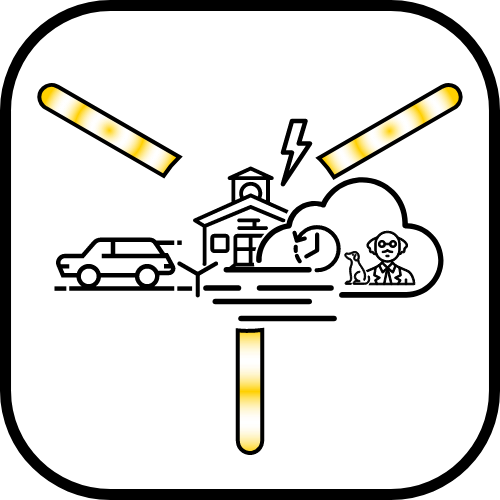

## Assignment

Now that you're part of a tribe, show some pride by designing your own tattoo that is symbolic of your tribe's culture. Step 1: Pick out an icon or set of icons at the Noun Project Website and remix it into your own unique design and post it to the # Mini-things channel. Here's the catch, don't let the other teams know your team's name. Step 2: Try to guess what the other team's name is through astute analysis.

***

<figure markdown>
  
  <figcaption>Boxy SVG</figcaption>
</figure>

## Backstory

Alright, a remix... I choose to export SVG from the noun project and began in Canva. As I started to layer icons, I needed to be able to hide pieces of them... I tried hiding things with boxes in Canva, but that quickly became unreasonable. So, I searched out another editor... and found [Boxy SVG Editor](https://boxy-svg.com/). It is very similar to Adobe Illustrator; however, some aspects seemed simplified - in a good way... so this worked great for remixing the icons from the noun project.

I actually found many icons representing my tribe - by name - but I selected alternative icons to not give anything away in the Attribution text. I spent a couple hours searching & remixing together icons to tell a little visual story. The whole mini-thing was created using only remixed icons. I might have started having to much fun stitching together the icons... Can you guess my tribes name?

## Time / Stretch

## Tools

-   [Boxy SVG Editor](https://boxy-svg.com/)
-   [The Noun Project](https://thenounproject.com)

## Attributions

-   [square](https://thenounproject.com/search/?q=square&i=987124) by Vladimir Belochkin from the Noun Project
-   [fog](https://thenounproject.com/search/?q=fog&i=680139) by Iulia Ardeleanu from the Noun Project
-   [Future](https://thenounproject.com/search/?q=future&i=2525275) by fae frey from the Noun Project
-   [bolt](https://thenounproject.com/search/?q=bolt&i=3182471) by Gajah Mada Studio from the Noun Project
-   [clock tower](https://thenounproject.com/search/?q=clock+tower&i=1153261) by Creaticca Creative Agency from the Noun Project
-   [intersection](https://thenounproject.com/search/?q=intersection+lines&i=3169292) by Zach Bogart from the Noun Project
-   [fast car](https://thenounproject.com/search/?q=fast+car&i=1266564) by Nikita Kozin from the Noun Project
-   [Dog](https://thenounproject.com/search/?q=dog&i=2755593) by Tauficon from the Noun Project
-   [Scientist](https://thenounproject.com/search/?q=scientist&i=3166564) by Flatart from the Noun Project
