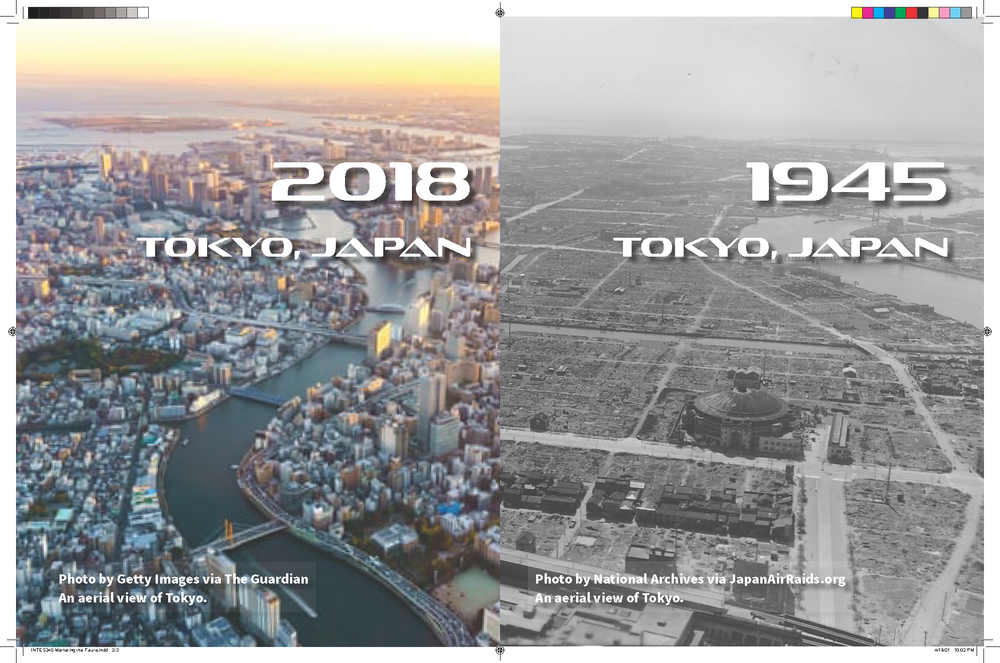

??? quote "Assignment"
    For this week, create a magazine or newspaper advertisement for a product or service in the year 2050. Choice of tools is up to you.

<figure markdown>
  
  <figcaption>Adobe Illustrator, Photoshop, & inDesign</figcaption>
</figure>

<figure markdown>
  
  <figcaption>Adobe Illustrator, Photoshop, & inDesign</figcaption>
</figure>

[Document Cloud: Marketing the Future](https://documentcloud.adobe.com/link/review?uri=urn:aaid:scds:US:ddfe993c-dc0d-4afd-af61-c73247009c84)

## Backstory

AR History is a continuation of my Storything, [An Artifact from the Future](../2021-02-06-mid-storything-1). I thought that initial idea lent itself to now be marketed for this project.

AR History has evolved over the next thirty years to incorporate all screens, including mobile, home, and vehicles. I envision windows becoming screens in the future, and well, windows are everywhere.

AR History has grown in its capabilities, thanks to an ever-growing image bank to work with. Google Earth just released a timelapse of the Earth spanning thirty years. So, in 2050 there will be an archive of 65 years worth of EArth images to work with, oh the possibilities.

## Process

I utilized the Creative Suite and followed the rule of thirds ([Wikipedia](https://en.wikipedia.org/wiki/Rule_of_thirds)) throughout my process. I had to use Illustrator to mask and set the opacity of the original images; I couldn't remember how to complete the task in Photoshop. I created two opacity masks to allow a visual overlap between images. I then linked the AI document in Photoshop and created a new layer to create a "fog effect" as an underlay to the Header and Sub Header text.

I then moved to InDesign, setting up a template with a 3x3 grid. Then created a basic layout, Header, Sub Header, Body text. I created paragraph formats for each text type; this is necessary since InDesign is blank when starting a new document. I then linked the Photoshop document into InDesign using an image frame covering the page. I completed the project by filling in the copy (text).

I then created a spread showing the original images.

Oh, and exported JPEG images from the PDF... I forgot, PNG format doesn't play nicely with circle - especially on mobile for some reason?

## Time & Stretch

This project took 4 hours, plus some time to recreate the linked Photoshop document I deleted. There was a couple of hours for ideation, a couple of hours for image searching, and then production. I choose to use InDesign because it's been a few months since I last used it and wanted a refresh. I like the workflow Adobe provides, allowing each document type to be linked without the need for exporting. It allows for easy updates across programs.

I tried to create a fog effect, using the eraser and paintbrush tools. I adjusted the size and opacity of the brushes to gain the effect. Having this file linked in Photoshop and InDesign allowed me to easily see the changes. Then again, I probably could have completed the project in Photoshop alone.

## Tools

- Adobe Illustrator
- Adobe Photoshop
- Adobe InDesign
- Adobe Acrobat

## Attributions

- Photo by Getty Images via [The Guardian](https://www.theguardian.com/cities/2019/jun/13/a-city-built-on-water-the-hidden-rivers-under-tokyos-concrete-and-neon), An aerial view of Tokyo.
- Photo by National Archives via [Japan Air Raids](https://www.japanairraids.org/wp-content/uploads/2010/09/289973-aerial-view-of-Tokyo.jpg), An aerial view of Tokyo.
