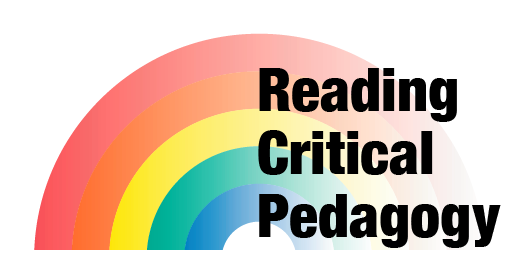
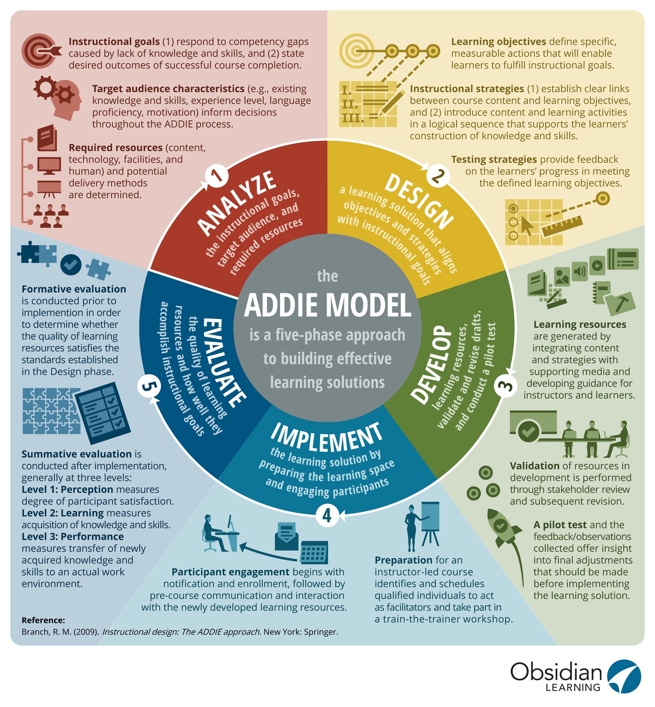

# Reading Critical Pedagogy

<figure markdown>
  
  <figcaption>Remix: Reading Rainbow</figcaption>
</figure>

Hello and welcome,

In todays world learning environments can stretch from classrooms, to computers, to mobile devices that go with us everywhere. And today, I find  myself out in the park here in Denver, Colorado. In fact, this is where I have spent most of my semester studying. With wifi available and of course cellular data, I have been able to stay connected to courses. This has been a great benifit to support mental health in difficult times; to be able to locate myself in an open space outdoors, really has helped to keep the mind open. And thats exactly what the readings in critical pedagogy have done as well.

I use the term "readings" broadly, as the texts I offer today were audio books, all located online at local libraries and accessed with the [libby app](https://libbyapp.com). I do have the physical copies of the books which are nice to sit with and highlight, and I even found the digital texts that allow for annotating digitally, but technology offers audio and even video to become options for exchanging information moving beyond print.

While listening to the texts, I found it frees the senses to think deeply about the authors words and helped me not get hung up in some of the complex ideas that can happen when reading critically. As the words poor over the ears in their entirity forming deep complex stories of critical pedagogy.

So to continue this, I have taken a step to record my annotations of some brief thoughts of these wonderful books that offer critical insight into our human relationships.

## Resources

Aziz-Zadeh, L., & Rock, D. (Hosts). (2021, October 25). Managing humans: The neuroscience of empathy (S6:E05) [Audio podcast]. In Your brain at work LIVE. NeuroLeadership Institute. <https://neuroleadership.com/podcast/managing-humans-the-neuroscience-of-empathy>

<iframe width="100%" height="166" scrolling="no" frameborder="no" allow="autoplay" src="https://w.soundcloud.com/player/?url=https%3A//api.soundcloud.com/tracks/1175880898%3Fsecret_token%3Ds-56v0By21i21&color=%23ff5500&auto_play=false&hide_related=false&show_comments=true&show_user=true&show_reposts=false&show_teaser=true"></iframe>

!!! info "Annotation"
    [Managing humans: The neuroscience of empathy](https://soundcloud.com/champa720/managing-humans-the-neuroscience-of-empathy/s-56v0By21i21) (SoundCloud)

    In this audio/video podcast (webinar) the differences between sympathy, empathy, and compassion are discussed by Dr. Aziz-Zadeh and Dr. Rock. What makes things slightly confusing, is that empathy contains all three. Yes, empathy equals sympathy, empathy, and compassion. What I enjoyed was the way each part of empathy became defined within neuroscience, whereas each part of empathy engages a different neural network, (1) sympathy is a thinking network, (2) empathy is a feeling network, and (3) compassion is an action or motor network. I think they did great in really discussing these differences and how they can be strengthened. A point I was not expecting was when they began discussing biases and how they affect empathy. One bias, experiential bias, stood out to me. Experiential bias has the ability to allow those with similar experiences to empathize more easily with each other. They then weigh how experiential bias may affect relationships. In the end, I found this podcast to be enlightening, and relevant for those seeking to apply empathy in the workplace or into instructional design models.

Barker, M. J., & Iantaffi, A. (2020). Life isn’t binary. Jessica Kingsley Publishers.

<iframe width="100%" height="166" scrolling="no" frameborder="no" allow="autoplay" src="https://w.soundcloud.com/player/?url=https%3A//api.soundcloud.com/tracks/1175880940%3Fsecret_token%3Ds-l7DP56MAv9X&color=%23ff5500&auto_play=false&hide_related=false&show_comments=true&show_user=true&show_reposts=false&show_teaser=true"></iframe>

!!! info "Annotation"
    [Life isn’t binary](https://soundcloud.com/champa720/life-isnt-binary/s-l7DP56MAv9X) (SoundCloud)

    Life Isn’t Binary is a discourse on binaries in our everyday lives. The book opens with sexual and gendar identities, but continues far beyond. The authors are great in picking up all the subtle binaries we live in and they further deconstruct how binaries impact our thinking. Each chapter provides an overarching topic, (1) sexualities, (2) genders, (3) relationships, (4) bodies, (5) emotions, and (6) thinking. Within each overarching topic different binaries are discussed. Binaries are presented in straight forward language with simple examples of how they affect people; often using real-world voices to describe the impacts. The authors are also aware that some of the discourse may bring up difficult memories, challenging reflections, and varying emotions; therefore, within the chapters the authors provide the reader with ques to slow down, take a break, breath, reflect, and then move on. I found this book full of insight into binaries and really revealed how much they impact the way we may view and interact with others.

Dunbar-Ortiz, R. (2014). An indigenous peoples’ history of the United States. Amsterdam University Press.

<iframe width="100%" height="166" scrolling="no" frameborder="no" allow="autoplay" src="https://w.soundcloud.com/player/?url=https%3A//api.soundcloud.com/tracks/1175880037%3Fsecret_token%3Ds-WhtFipHwIrz&color=%23ff5500&auto_play=false&hide_related=false&show_comments=true&show_user=true&show_reposts=false&show_teaser=true"></iframe>

!!! info "Annotation"
    [An indigenous peoples’ history of the United States](https://soundcloud.com/champa720/an-indigenous-peoples-history-of-the-united-states/s-WhtFipHwIrz) (SoundCloud)

    If there ever was a book that details the effects of colonialism, this might be it. It not only details the historical events of colonialism, but also paints a vivid picture of how a settler-colonialist mindset is perpetuated and still prevails. The discourse begins by introducing the rich history of indigenous peoples living in North and South America; describing the culture, society, governments, trade networks, and more. This is an important beginning, as the origin story of the United States excludes all this information, as Dunbar-Ortiz reminds readers throughout the book time and time again. Indigenous peoples' history should be more prominent in American History. I thought it was an interesting detail that Dunbar-Ortiz pointed out that the traditional canon (prescribed educational content) for history omits nearly every aspect of indigenous struggles and relations in American History. Dunbar-Ortiz also extends the discourse at several points into how these settler-colonialism mindsets are still present and how they have contributed to government policies affecting other peoples and nations throughout history.

Freire, P., Ramos, M. B., & Macedo, D. (2000). Pedagogy of the oppressed (30th Anniversary ed.). Continuum.

<iframe width="100%" height="166" scrolling="no" frameborder="no" allow="autoplay" src="https://w.soundcloud.com/player/?url=https%3A//api.soundcloud.com/tracks/1175880679%3Fsecret_token%3Ds-seLfF4jRzb8&color=%23ff5500&auto_play=false&hide_related=false&show_comments=true&show_user=true&show_reposts=false&show_teaser=true"></iframe>

!!! info "Annotation"
    [Pedagogy of the oppressed](https://soundcloud.com/champa720/pedagogy-of-the-oppressed/s-seLfF4jRzb8) (SoundCloud)

    Perhaps this book is at the root of understanding critical consciousness, or conscientização. Friere’s writing is full of meaning, with what feels like every word is intentionally chosen, but in doing so creates deep complex ideas. However, Freire reiterates these ideas in new ways, using different wording to clarify and continue building these ideas. Stressing points that a liberatory pedagogy includes love, dialogue, hope, and humility; and describes how each is necessary and how without we are left with oppression. Freire’s discourse begins the journey by describing the oppressor and oppressed relationship, and describes the dehumanizing characteristics. Next, attention is given to describing the role of the banking concept of education, which Freire details as oppressing the oppressed. Dialogue is the counter to the banking concept, one that seeks to develop a critical consciousness, through critical inquiry. Inquiry based on critical reflection and action, or as Freire named it, praxis.

Hoff, B. (1983). The tao of pooh (First Edition). Penguin Books.

<iframe width="100%" height="166" scrolling="no" frameborder="no" allow="autoplay" src="https://w.soundcloud.com/player/?url=https%3A//api.soundcloud.com/tracks/1175880106%3Fsecret_token%3Ds-TYmk3iBtWpL&color=%23ff5500&auto_play=false&hide_related=false&show_comments=true&show_user=true&show_reposts=false&show_teaser=true"></iframe>

!!! info "Annotation"
    [The tao of pooh](https://soundcloud.com/champa720/the-tao-of-pooh/s-TYmk3iBtWpL) (SoundCloud)

    An exemplary writing on Taoism; one that is easily digestible and fun, but also does not escape explaining the principles of Taoism. The first principle explained in the story is that of the uncarved block, or that everything in nature is just as it is to be; before being forced to be something it is not. Trying to understand such abstract principles is where Hoff’s storytelling really shines through incorporating stories of Pooh, Piglet, Rabbit, Owl, etc. In a later chapter, Hoff describes Taoism in action, or that of doing without doing. To me, this connects with Freire’s notion of the teacher-student; in that, how does one teach without teaching.

hooks, b. (1994). Teaching to transgress: Education as the practice of freedom. Routledge. <https://doi.org/10.4324/9780203700280>

<iframe width="100%" height="166" scrolling="no" frameborder="no" allow="autoplay" src="https://w.soundcloud.com/player/?url=https%3A//api.soundcloud.com/tracks/1175880589%3Fsecret_token%3Ds-z63eaI9ZulX&color=%23ff5500&auto_play=false&hide_related=false&show_comments=true&show_user=true&show_reposts=false&show_teaser=true"></iframe>

!!! info "Annotation"
    [Teaching to transgress](https://soundcloud.com/champa720/teaching-to-transgress/s-z63eaI9ZulX) (SoundCloud)

    This is truly a powerful read; hooks’ writing is a style full of personal narratives interwoven with personal reflections and theory. Each chapter is full of insight into how education can be a liberatory practice. Empathy is ever present in hooks’ discourse, conveyed both in the classroom and in the community; it seems as if hooks is always striving to build a greater understanding with everyone she meets. These stories often segue into reflection, allowing the reader to gain a sense of a critical consciousness with hooks. These reflections are then juxtaposed into discourses of theory and then tied into the oppressive nature that the dominant culture upholds, essentially challenging or interrogating these norms. As I read, I felt connected to the pain in the stories, but also felt the sense of healing that hooks’ was sharing. For me this was a driving theme, healing, one that hooks was aware that students needed time for as well. She raised the issue that when students begin to look more critically at the world around them, it's not surprising that they may start to see their friends and families in a different light. When this happens, hooks’ provides a space to share these experiences within the classroom, in essence building community. As stories unfold, building community in classrooms without changing the current structures and thought process behind these structures, do little to advance a liberatory pedagogy.

Kendi, I. X. (2019). How to be an antiracist. Penguin Random House. <https://doi.org/10.1177/0196859920961032>

<iframe width="100%" height="166" scrolling="no" frameborder="no" allow="autoplay" src="https://w.soundcloud.com/player/?url=https%3A//api.soundcloud.com/tracks/1175881033%3Fsecret_token%3Ds-BdqjneVB6lY&color=%23ff5500&auto_play=false&hide_related=false&show_comments=true&show_user=true&show_reposts=false&show_teaser=true"></iframe>

!!! info "Annotation"
    [How to be an antiracist](https://soundcloud.com/champa720/how-to-be-an-antiracist/s-BdqjneVB6lY) (SoundCloud)

    A captivating book, based on Kendi’s lived experience. The words are thoughtfully laid out to question and examine the many facets of racism. It is a story that details pain, struggle, and systemic inequalities. Kendi explores the deep roots of racism through several dimensions, the chapters include (1) power, (2) biology, (3) ethnicity, (4) body, (5) culture, (6) behavior, (7) color, (8) class, (9) space, (10) gender, and (11) sexuality; there are 18 chapters in total. At the preface of each chapter, Kendi defines keywords that will later be part of the chapter's discourse, such as in chapter one, racism and anti-racism; or in chapter two, assimilation and segregation. In this way, Kendi builds a common vocabulary for what is to be a central part of the chapter which is told through personal narrative, but is expounded into larger thoughts for society and systems.

## Initial Takeaway

First, my curation annotations do not do justice to the resources collected for this expansion. Many reads and ample time for reflection to digest the value within these works are in my future. However, these are my best attempts to highlight the works and their importance was given.

As I read and listened to the resources, I found many overlaps within the discourse being presented; although, each story was unique to the authors presenting. Take, for example, dual thinking. As Freire touched upon the idea in _The Pedagogy of the Oppressed_ (2000). One of Friere’s examples was in relation to taking a humanist approach to education, highlighting how the banking-model of education doesn’t serve the oppressed. This model is an analogy, whereas the teacher is depositing information into students, rather than a mutual learning environment where the roles of teacher and student are interchangeable. If the banking model is used by a revolutionary, or a person seeking to free the oppressed, then those they are seeking to free are merely swapping out one mantra for the other and doesn’t lead to dialogue, self-actualization, or developing a critical consciousness. Simply put, Freire proposes praxis, a state of reflection and action, to break this process.

In _How To Be An Antiracist_ (2019), Kendi touches upon that racist thinking presents two-views, the first being racist thinking, and the second, not racist thinking. I found that Kendi used dueling views in several chapters. Take chapter three for instance, where Kendi compares assimilation and segregation. These dueling views have been reinforced by dominant culture as a way for marginalized peoples to exist; however, neither approach emancipates the individual, forces the individual to change, or excludes the individual from the dominant culture, which is why, like Freire and others I read, Kendi provides a third option—antiracist. It is this point that is expounded upon in each chapter.

Then there is how hooks’ brings much of her discourse back to institutions of higher education, in _Teaching to Transgress_ (1994). Questioning the dual thinking present in education, one example being that of scholarly and non scholarly works. Through several stories hooks identifies ways that these dueling views are defined by a dominant group, to exclude voices, and utilized to maintain power and control. Hooks’ approach to breaking the dueling views is based in dialogue, much like Freire, however I found hooks’ discourse to be highly empathetic and compassionate, as opposed to Friere’s logic driven writing style.

When thinking about dual thinking, _Life Isn’t Binary_ (2020) puts forth numerous examples of how dual thinking is harmful. In the concluding chapter, the authors present their thoughts on non-binary thinking as a way to depart from dual thinking. Their points center on honoring individuals' humanity, and like others, dialogue is the key. However, they address some points of failure in dialogue, such as some aspects of individuals and experience are not open to debate as this suggests that there's two-sides—winner and loser for example—and that debates lead the dialogue back into the binary, or dual thinking.

Even within _The Tao of Pooh_ (1983), the first principle is that in nature, things are as they should be, before we try to make them what they are not. To me, this is another recognition that dominant groups have imposed a way of thinking and acting in the world. And yes, reading through the philosophy provides insights on how to overcome it.

It is a surprising overlap, in the resources, that critically looking at binary thinking is freeing and liberating for those oppressed, marginalized, and excluded. Which makes some sense, in that if we are to be more inclusive, dropping the binary of us and them—the idea of othering—would include deconstructing the dual thinking approach that the dominant oppressive thinking has created, as one example.

How is this accomplished? Again an overlap in the texts suggests that dialogue, a back and forth exchange is necessary. However, a more critical dialogue, one that raises the issues of inequalities and systems that disempower, marginalize, and dehumanize. Each author has stories of how this dialogue may take place, I believe I noted some in the content curation summaries.

For instructional design, or educational planning, this may originate from the point of empathy, applied in analysis for some models. However, one should be aware that bias may exist in this relating; as experiential bias was raised as a bias to be aware of within empathy by Aziz-Zadeh and Rock (2021). Moving forward in the design models, content and engagement would then be considered critically.

When diversifying content, hooks raises the concern of tokenism; and suggests that this is an opportunity to engage in further dialogue surrounding issues of race, class, and gender. Merely including marginalized voices, without including further dialogue perpetuates the same oppressive nature. Or as Dunbar-Ortiz (2014) puts forth, that first we must have dialogue in the ways settler colonialism has dominated our thinking in society before we can begin discussing ways to undo this thinking.

To be honest, I took in a lot of information and have only begun to gather my thoughts. To find a place to start to apply a critical pedagogy, I think would be unique for each striving to be more critical in their processes. But, I find with all resources another overlap exists: in starting a long journey, it begins with the first step. And maybe this first step is in consciousness, or as Freire named it, conscientização.

## Update: 2021-12-10

When looking at instructional design models, the industry standard ADDIE (Analysis, Design, Develop, Implement, Evaluate) comes to mind. So I will apply my thinking to this model. However, I am confronted by a challenge by choosing this model, in that, the model was created to serve the military (Penn State, n.d.). So, wouldn't that mean education has adpoted a model that has compliance, obiedience to authority, and militarized (colonialist) thinking at its root?

Moving beyond ADDIE's origin, it is still the industry standard. And as such, many issues have already been raised and have created alternative models or expaded upon the ADDIE process. However, it still represents a skill set that instructional designers are to have experience with and demonstrated mastery of (ADDIE Model, 2018; The ADDIE Model of Instructional Design, 2019).

As noted in the initial takeaway, I have only begun thinking about how readings in critical pedagogy can begin to overlay the industry standard model of instructional design. At the moment, I can only begin to describe these and where they may fall.

- **Analyze:** Empathy with an awareness of experiential bias
- **Design:** Content represenative of human diversity; space to highlight the significance of the voices and experiences; respect for neurodiversity
- **Develop:** Consciously building safe and inclusive; awareness of technological biases and inequalities
- **Implement:** Makes this iterative and adaptable to the human experience of those involved in the learning
- **Evaluate:** Authentic demonstrations of learning

<figure markdown>
  
  <figcaption>ADDIE Model (Penn State, n.d.)</figcaption>
</figure>

### Resources

- ADDIE model. (2018, November 30). InstructionalDesign.Org. <https://www.instructionaldesign.org/models/addie>
- The ADDIE model of instructional design. (2019, June 21). Devlin Peck. <https://www.devlinpeck.com/posts/addie-instructional-design>
- Penn State. (n.d.). Instructional designer’s handbook. Pressbooks. <https://psu.pb.unizin.org/idhandbook>

## Additional Annotations

- [Critical Leadership](/basecamp/Digital-Pedagogy/INTE-6720/2021-10-23-project-2)
- [Social Justice: Diversity, Equity, and Inclusion (DE&I) — Trauma Informed Practice (TIP) — Social Emotional Learning (SEL) — Justice-Involved](/basecamp/Digital-Pedagogy/INTE-6720/2021-09-04-resource-scan)
