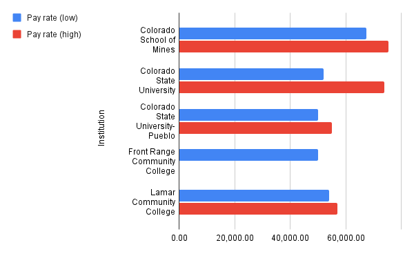
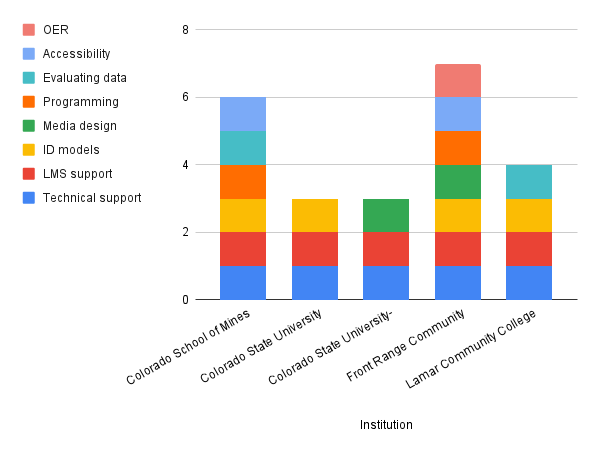

# Career Inquiry

[DRAFT] Job Search

I have a long professional work history in education, beginning in TRIO Programs: (1) supporting many first–generation high school graduates (High School Upward Bound), and (2) supporting first–generation college students (Student Support Services, Veterans Upward Bound). I worked in K12, Middle & High Schools, and as Special Education Instructor in a youth facility for runaway, abused, and justice-involved youth (Family Tree). In 2010, I found myself in the niche arena of Adult Basic Education & Family Literacy – instructing, designing curriculum, and managing programs. This was through the Community College of Denver and community partner organizations: (1) Mi Casa Resource Center, (2) The Gathering Place, (3) Denver Indian Center, and (4) Denver Housing Authority. One of my final projects while at the Community College of Denver was designing and developing a distance learning program meeting state partner (Colorado Department of Education) requirements. This program was rapidly expanded in 2020 when all programming went online, and I became the lead trainer to bring seven instructors and 200+ students into it. It was successful and we shared the model out to other programs during the transition.

Currently, I’m presiding over Colorado’s Adult Basic Education support, resource, and advocacy group, CAEPA, in a volunteer capacity.

A year ago, in August 2020, I began the Learning Design and Technology Master’s program when funding cuts left me unemployed. I initially applied to several positions within the Community College System, but was lacking a Master’s which was required for many of the positions. So, as my last program's grant funding came to an end, I redirected my attention towards personal development.

I am graduating this year, in December 2021. With graduation around the corner, I’m searching to get back to mission driven employment and preferably back into employment within Higher Education. I have been applying to job announcements while completing the program, but I have not had any employers take notice. In completing this career inquiry, my purpose is to look at job announcements in a different light and uncover requirements that may have been overlooked while submitting previous applications.

## Literature Review

Marissa Arnquist (2020) conducted six open-ended interviews with individuals employed in eLearning and completed a job search for the purpose of defining the skills and competencies required to enter the field. During background research, Arnquist discovered the field is varied, and still evolving with a lack of consistent naming conventions. Arnquist discovered a lack-of eLearning specific articles and defaulted to Technical Communications for the literature review. Arnquist identified ten top skill competencies in the literature review and later refined these to current job market demands in the study: (1) Instructional design, (2) Interpersonal skills, (3) Project / Time management, (4) Writing, (5) Quick learner, (6) Assessment / analytics, (7) Visual design. Arnquist spent time defining key skills, such as interpersonal communication, empathy, curiosity, as well as additional skills, project management, visual design, strategy, and pedagogy. Pedagogy was referenced many times as being overlooked or misunderstood by the interviewees, with some stating qualities of importance but ultimately lumped pedagogy into design models, i.e. ADDIE. Arnquist also outlined common tools, team dynamics, and points of frustration found in the field, as well as the many titles these professionals carry.

Xie et al. (2021) conducted eight interviews with iInstructional dDesigners working within higher education across the midwest of the United States. The study utilized nine questions and were developed using strengths, weakness, opportunity, and threat (SWOT) analysis. The purpose of the study was to determine how emergency remote teaching, due to the pandemic, changed the roles and responsibilities of iInstructional dDesigners. Xie et al. found that initially during the transition instructional designers were engaging in technical support in-order to build relationships and connections with teaching faculty. To reach a broader audience blogs were created to support the transition, as well as recording professional development for teaching faculty with topics including: (1) migrating instructional materials, (2) media production, (3) strategies for video conferencing, and (4) guidance in scaling back assignments. Instructional designers noted they saw a pedagogical shift from the teaching faculty, away from lecture based styles to engaging with students through more frequent communication and discussions, personal stories, and showing empathy. The interviewees have hopes that because of the emergency remote teaching that instructional designers’ roles and responsibilities would become more defined, more respected as a professional, and seen more as a resource and support for teaching faculty.

## Methodology

Utilizing HigherEdJobs.com a job search was conducted utilizing an advanced search. Job announcements were filtered by one criteria, job category. The category selected was “Admin - Instructional Technology and Design” as it was noted during a keyword search for “Instructional Designer” that all announcements were grouped under this category. The remaining advanced search options were left as default. Options included position type (full/part time), institution type (four-year, two-year, outside higher education), and location type (location bound, remote). The defaults included the widest possible search, including all options, and revealed 431 job announcements with a variety of titles and entry levels. To refine the search, “Colorado” was defined as the location revealing seven job announcements. Colorado was selected as the state has a law requiring job announcements to include the rate of pay.

With the job announcements refined a spreadsheet was created utilizing a new line for each position title. Headings were initially created with the constants within the job announcements: (A) Position title, (B) Institution, (C) Location, (D) Pay rate (low), (E) Pay rate (high), (F) Education (required), and (G) Education (preferred). To determine the skills and competencies both the minimum and preferred requirements would be considered and broadly coded into categories, where “1” equals “yes” and a “0” equals no/undefined. For example, “Experience supporting and administering a learning management system, preferably Canvas” (Colorado School of Mines, 2021), would be coded as LMS support equals 1.

Based on the first job announcement viewed, these categories included (H) Higher Ed experience, (I) Previous experience, (J) Technical support, (K) LMS support, and (L) ID models. New columns were added as job announcements expanded the categories, to include: (M) Media design, (N) Programming, (O) Evaluating data, (P) Accessibility, (Q) OER, (R) Specialized. The final column, Specialized, refers to job announcement specific qualifications, such as grant management or Wordpress plugins. To see the complete data set, view the [spreadsheet data](https://docs.google.com/spreadsheets/d/1ujzYTAESft3Tr17eSuYPM5RKAIgsw0EWMbXeua3f9_g).

## Findings

From the seven job announcements in Colorado, the evaluation includes only five as two of the announcements were for part-time temporary library support roles, paying an hourly rate. Of the five remaining job announcements, the job titles varied but “Instructional Technologist” was most commonly referred to. Each job announcement requires a Bachelor's degree, however all prefer a Master’s degree; the degree is sometimes specified, but also includes a catch all phrase of related. The aggregate pay rate for the positions in the dataset averaged $54,680 (low) and $65,350 (high), see chart 1.

<figure markdown>
  
  <figcaption>Chart 1: Pay rate, low and high</figcaption>
</figure>

Each position requires previous experience working in higher education settings, with two not defining length of experience, two requiring two-years experience, and one having a sliding scale of one- to two-years depending on education level. All require technical and learning management support, which aligns to the findings in Xie et al. (2021). For a full list of required and preferred skills, see chart 2.

<figure markdown>
  
  <figcaption>Chart 2: Required and preferred skills</figcaption>
</figure>

As the job announcement requirements move beyond technical support, learning management support, and knowledge of instructional design models and theories, they become increasingly more specific to the needs of the institution. Media design is vaguely described as demonstrated experience, or additionally with a list of authoring tools (Colorado State University-Pueblo, 2021; Front Range Community College, 2021). Programming can be defined as experience with HTML, CSS; but may also include scripting languages and API knowledge (Colorado School of Mines, 2021; Front Range Community College, 2021).

## Reflection

It’s interesting to see how sparse or densely descriptive each job announcement can be. The more descriptive announcements tended to be special initiatives put forth by the institution and explained in detail the initiative and need for the position. It’s also interesting to see how specialized a position description can be; such as Lamar Community College is looking for “IREPO” Grant Director / Instructional Designer - a dual position - or how Front Range Community College has the most comprehensive requirements, and yet offers the lowest salary. Since both of these institutions are community colleges, it might speak to the resources these institutions have available. The most surprising requirement is that all the job announcements require former work experience in higher education; this requirement may be a barrier to those that otherwise might be a viable candidate for the position. It is also interesting to see that only two of the five institutions listed knowledge and use of accessibility guidelines as a requirement.

## References

Arnquist, M. (2020). The role of the technical communicator in the corporate eLearning industry. University of Minnesota Digital Conservancy. <https://hdl.handle.net/11299/213219>

Colorado School of Mines. (2021, September 24). Instructional technologist. HigherEdJobs. <https://www.higheredjobs.com/search/details.cfm?JobCode=177625200>

Colorado State University. (2021, August 16). Educational technologist (ed tech) / online CE course coordinator. HigherEdJobs. <https://www.higheredjobs.com/search/details.cfm?JobCode=177579869>

Colorado State University-Pueblo. (2021, September 22). Educational technologist. HigherEdJobs. <https://www.higheredjobs.com/search/details.cfm?JobCode=177620193>

Front Range Community College. (2021, August 9). Coordinator, learning design and production. HigherEdJobs. <https://www.higheredjobs.com/search/details.cfm?JobCode=177574001>

Lamar Community College. (2021, October 1). IREPO grant program director and instructional designer (PD/ID). HigherEdJobs. <https://www.higheredjobs.com/search/details.cfm?JobCode=177603877>

Xie, J., A, G., & Rice, M. F. (2021). Instructional designers’ roles in emergency remote teaching during COVID-19. Distance Education, 42(1), 70–87. <https://doi.org/10.1080/01587919.2020.1869526>
