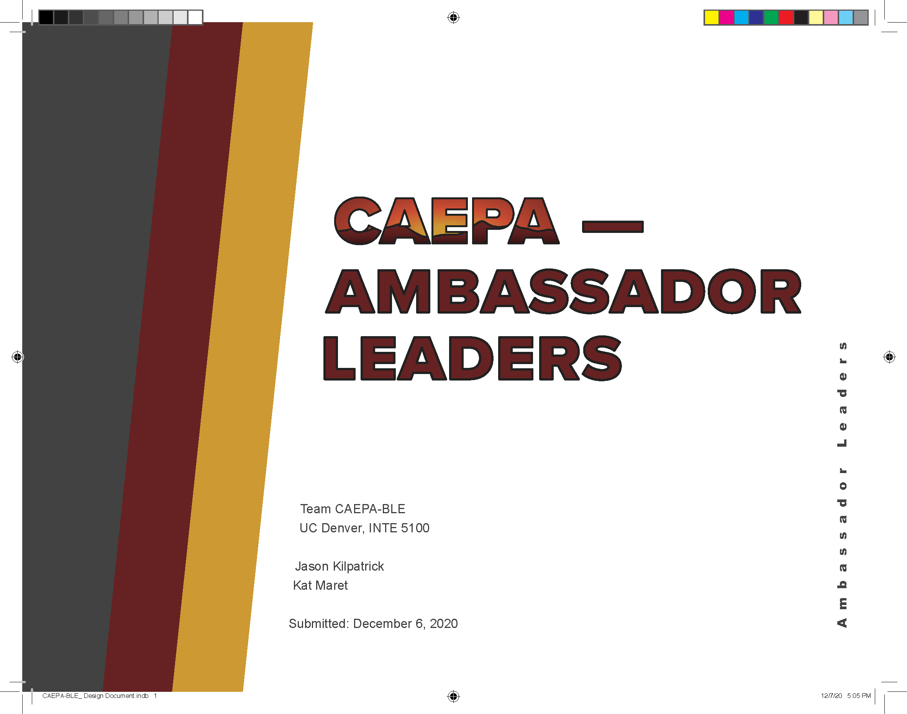
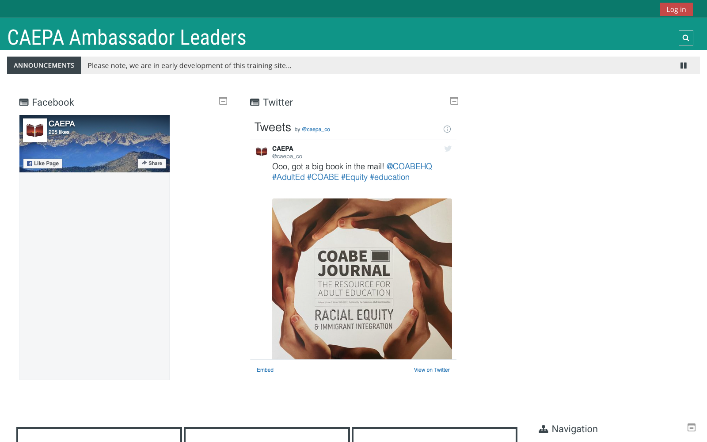

# Learning Experience Design

>
  _Instructional design is the process used to analyze, design, develop, and evaluate learning solutions. You will identify a gap in learning or performance and design a learning solution in the form of courses units, modules, and other instructional resources_ ([UC Denver](https://catalog.ucdenver.edu/cu-denver/graduate/schools-colleges-departments/school-education-human-development/learning-design-technology/)).

  <iframe class="aspect-ratio--content" src="https://www.youtube-nocookie.com/embed/ueb9jQ_Z8X0" title="YouTube video player" frameborder="0" allow="accelerometer; autoplay; clipboard-write; encrypted-media; gyroscope; picture-in-picture" allowfullscreen></iframe>

## Adobe inDesign Document

<figure markdown>
  
  <figcaption markdown>[CAEPA - Ambassador Leaders](https://documentcloud.adobe.com/link/review?uri=urn:aaid:scds:US:43fee04c-b1c1-45c8-b204-506f8916a71b) (Document Cloud)</figcaption>
</figure>

## Moodle LMS

<figure markdown>
  
  <figcaption markdown>[CAEPA - Ambassador Leaders](https://moodle.caepa.org) (Moodle LMS)</figcaption>
</figure>
