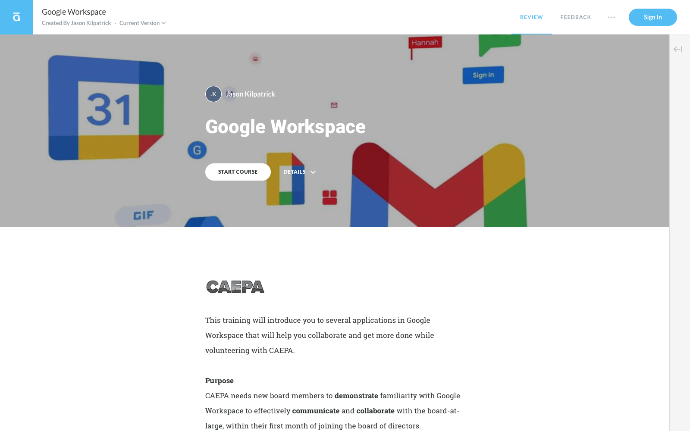

# Developing Self-Paced Online Modules

>
  _Students use a variety of tools and strategies to develop self-paced eLearning courseware, such as tutorials. The course covers critical aspects of the instructional development process that support the creation of effective self-paced online learning experiences, materials and resources_ ([UC Denver](https://catalog.ucdenver.edu/cu-denver/graduate/schools-colleges-departments/school-education-human-development/learning-design-technology/)).

## Adobe inDesign Document

<figure markdown>
  
  <figcaption markdown>[Information Technology: Google Workspace](https://documentcloud.adobe.com/link/review?uri=urn:aaid:scds:US:0fb072c4-e0f5-4c79-9674-707ca5abb01d) (Document Cloud)</figcaption>
</figure>

## Articulate Rise

<figure markdown>
  
  <figcaption markdown>[Information Technology: Google Workspace](https://360.articulate.com/review/content/fb26fcab-0d74-4bd8-b9d4-bcab1cb3019d/review) (Articulate Rise)</figcaption>
</figure>
