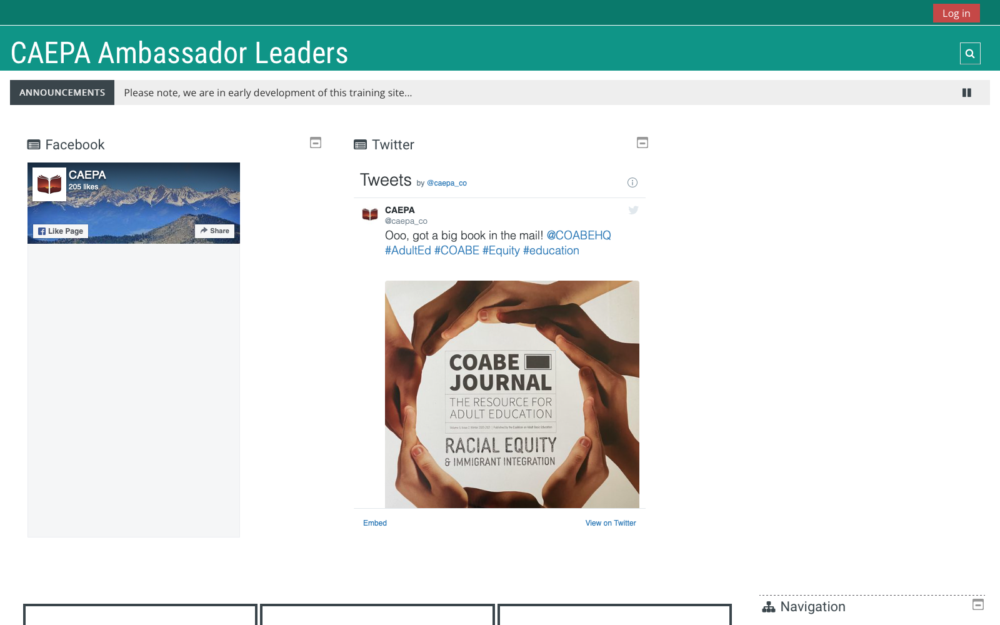

??? quote "Assignment"
    It should be a stand alone learning object for your basecamp / portfolio or an aid to any other educational / instructional environment. Ultimately what I'm looking for is something that makes sense and is effective to your individual situation.

    Example projects include:

    - Instructional/Educational mobile app
    - Series of 1 minute instructional tips or a longer video based narrative demonstrating a process
    - Instructional/Educational mobile web site.
    - Instructional/Educational podcast series
    - Instructional/Educational eBook

    While there are no specific restrictions on the size or length of the final project you should evaluate your idea and apply your resources in a manner that best reflects your individual situation given the time allotted to complete the effort. A few years ago this course focused primarily on audio and video and I used to require student's projects to be at least 5 minutes of content and no longer than 20 minutes, you can use that as a guide if you would like. If you are creating an activity such as an instructional module or application, use the same time frame as a general guide around the length it should take a user to complete it. If you chose to create a series of media, I strongly recommend that you develop a method for distributing it. Sharing several links is not conducive to those on mobile devices. Successful projects in the past have built simple responsive pages/websites with the media embedded or simply created a playlist utilizing the their chosen delivery platform. If you are planning multiple angles, graphics, narration and alternatives, It could require a significant effort and would satisfy a final project. However, if the length and desired production of the video are planned to be shorter and simpler, I would prefer to see a little more than one short video for your final project. Remember, the overall experience on a mobile platform is critical towards your grade.

    _Note: For grading, this project will be viewed solely on a mobile device and it's accessibility and functionality on that device will reflect the grade. YouTube is one of the best resources for disseminating video to all devices however, simply placing content on YouTube and deeming it "mobile" ready doesn't always do the job. We'll be looking at the video's format and how well it translates to a mobile device. Things to consider will be font size, readability of graphics, length etc._

!!! info
    Title: CAEPA - Ambassador Leaders  
    Tools: Moodle LMS  
    Link: [CAEPA - Ambassador Leaders](https://moodle.caepa.org) (Moodle LMS)  
    Link: [CAEPA - Ambassador Leaders mobile](https://download.moodle.org/mobile) (Moodle LMS)

## Learning/Experience

The overall project is for CAEPA, a nonprofit, supporting Colorado Adult Educators.

Admittedly, I am ambitious and I did not get to create all the media I was hoping to produce for this final project. I did, however, make great strides and produced nearly three microlearning courses, not including assessments. I had my hands full, with the media production and setting up a learning management system. And while designing the media, I was thinking about the future audience and how to make the media most relevant to them. In the end, I wanted to show off as many production tools as I could... unfortunately, I did not get through all that I hoped to.

I had big plans for the Welcome and Introduction page for the Ambassador Leaders program. But I worked backward towards this all-important page/course. A page/course to inform future contributors about the professional learning model...

## Tools
- DreamHost
- Moodle
- iPhone 12 mini
- Quicktime
- Prezi
- Adobe Premiere Rush
- Adobe Premiere Pro
- Adobe Audition

## Successes
I set up a self-hosted version of Moodle. I upgraded the self-hosted software successfully.
I created a course for both versions of Adobe Premiere, Rush, and Pro. However, I only published the Rush version as when I was thinking about the final audience, most would not have access to Pro, but, Rush is free!
I managed to create three micro-learning courses, or at least have them underway.
Learning how to build a course in Moodle.

## Struggles

I had one of those moments. You know the type. You follow the same procedure as you have done in the past, but the result is not as expected. I am describing my screencast and audio for the Adobe Premiere Rush course. I was working within Adobe Premiere Pro and the playback looks fine; however, when I nested the video and adjusted the durations, the quality became jittery. This has not happened in the past. Then, after recording the audio voiceover and importing it to Adobe Premiere and Adobe Audition, the quality deteriorated.
So, after several trials, including re-recording, re-importing, and re-rendering, I was not able to figure out where things are going wrong.

Moodle's text editor does some weird formatting of text when copy & pasting in text. These errors only show themselves on the mobile version.

## Attributions

- none
