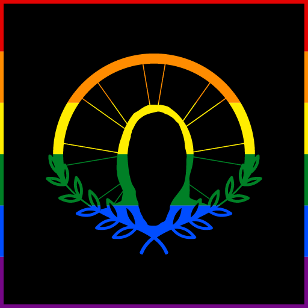
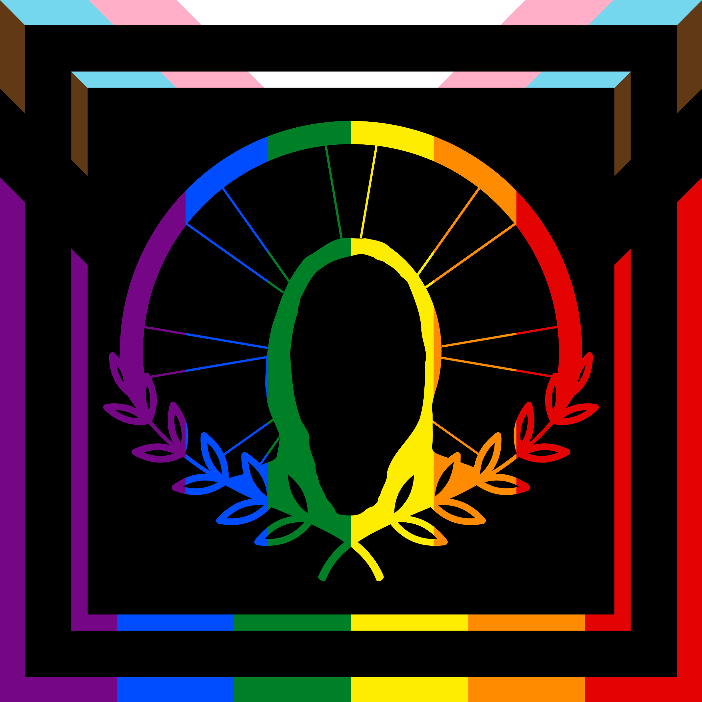

*What are three strengths as a designer?*

My three strengths are: I’m not afraid to experiment, I like to iterate on an idea, I’m playful, and I consider the person I’m designing for from the start.

*What are my favorite colors?*

My primary favorite colors are pink and purple. I generally use colors sparingly.

*What designers and/or design professions do I love?*

I follow many design blogs. They consist of Graphic Design, Web Design, Architecture, Product Design, and Art in general. They all have a common thread, even though each topic is different. I see that each is highlighting the many different ways in which designers can convey messages. Each is highlighting the way designers are engaging their audience.

*What design work do I enjoy?*

I’ve always been into the arts, exploring multimedia and sculpture. I began my college career studying pursuing a BA in Fine Arts. I enjoy all facets of design work, including preliminary research and prototyping. I like iterating and adding meaningful details as the project moves towards a “final” state.

*What kind of work do I want to do in the future?*

I have been pondering this question for some time, especially since beginning the Learning Design and Technology program back in Fall 2020. As I have been scouring the job boards, interviewing, searching for internships, and talking with peers, I have come to know that I am a mission-driven person. The field of LXD/ID is diverse, but I would most enjoy it in an environment serving the greater good. I would like to throw my creativity, experience, and skills to develop content, curriculum, and programming to support an organization in supporting the community they are serving.

## Submission

I created my logo using icons from the noun project and original photography. I used Adobe Photoshop, Illustrator, and inDesign to piece it all together. The logo was inspired by the assignment questions and the Zoom! Activity: Photos Galore.

The bicycle wheel represents me, its my primary transportation and a piece of my everyday life and carries a deep meaning for me. The olive branches are a symbol of peace and harmony, something I carry in my life and work. I sit in the center, forgoing any identifying features as I try to live anonymously in my digital presence but could also represent a devotion to selflessness - something that is apart of my nature. The touch of color brings a subtle nod to the rainbow in celebration of my LGBTQ+ pride.

## Logo v1

<figure markdown>
  
  <figcaption>Adobe Photoshop, Adobe Illustrator, Adobe inDesign</figcaption>
</figure>

## Logo v2

<figure markdown>
  
  <figcaption>Adobe Photoshop, Adobe Illustrator</figcaption>
</figure>

## Logo v3

<figure markdown>
  
  <figcaption>Adobe Photoshop, Adobe Illustrator</figcaption>
</figure>

## attributions

- [Bicycle Wheel](https://thenounproject.com/term/bicycle-wheel/44234) By Predrag Jovanovic, RS

- [Branches of olives](https://thenounproject.com/search/?q=olive+branch&i=1951479) By Olena Panasovska, UA
